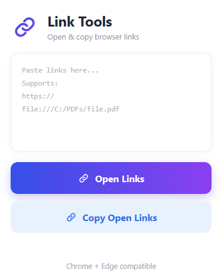
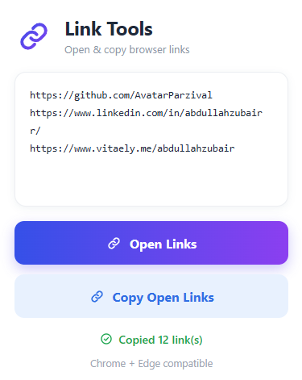

<div align="center">


# Link Tools

**Open & copy browser links — instantly.**

A lightweight Chrome & Edge extension that opens a whole list of pasted links in one click and copies every URL from your open tabs to the clipboard. Supports `https://` web links and local `file:///` paths such as PDFs. No tracking, no accounts, no network calls — everything runs locally in your browser.


</div>

---

## Table of Contents

- [Purpose](#purpose)
- [Features](#features)
- [Screenshots](#screenshots)
- [Installation](#installation)
- [Usage](#usage)
- [Permissions](#permissions)
- [Project Structure](#project-structure)
- [Author](#author)
- [License](#license)

---

## Purpose

Opening dozens of links one by one is slow, and there is no built-in way to grab every URL you currently have open. **Link Tools** solves both problems from a single popup:

- **Batch open** — paste any list of links (one per line) and open them all in background tabs, without losing your current tab.
- **Batch copy** — collect the URLs of every open tab into your clipboard in one click, ready to paste into notes, docs, tickets, or a message.
- **Local files too** — works with `file:///` paths, so saved PDFs and offline documents open just like web pages.

It was built for anyone juggling research sessions, client dashboards, job applications, bug reports, or study material — where the same set of links gets opened and shared again and again.

---

## Features

| Feature | Description |
| --- | --- |
| Batch link opening | Opens every valid link from the textarea in background tabs |
| Tab URL export | Copies all open tab URLs to the clipboard and shows them in the box |
| Duplicate removal | Identical links are automatically de-duplicated |
| Local file support | Handles `file:///` paths alongside `http://` and `https://` |
| Instant feedback | Green status line confirms how many links were opened or copied |
| Fully offline | No servers, no analytics, no data ever leaves your machine |
| Manifest V3 | Built on the current Chrome extension platform |

---

## Screenshots

<table>
  <tr>
    <td align="center"><b>Popup — ready for input</b></td>
    <td align="center"><b>Popup — links copied</b></td>
  </tr>
  <tr>
    <td></td>
    <td></td>
  </tr>
</table>

---

## Installation

Link Tools is installed as an unpacked extension. It takes about a minute.

### Google Chrome

1. **Download the code** — click `Code → Download ZIP` on this repository, or clone it:
   ```bash
   git clone https://github.com/your-username/link-tools.git
   ```
2. **Unzip it** (if you downloaded the ZIP) to a permanent folder — deleting the folder later removes the extension.
3. Open Chrome and go to `chrome://extensions`.
4. Turn on **Developer mode** using the toggle in the top-right corner.
5. Click **Load unpacked** and select the folder that contains `manifest.json`.
6. Link Tools now appears in your extension list. Click the puzzle-piece icon in the toolbar and **pin** it for one-click access.

### Microsoft Edge

1. Follow steps 1–2 above.
2. Open `edge://extensions`.
3. Enable **Developer mode** in the left sidebar.
4. Click **Load unpacked** and choose the extension folder.
5. Pin the icon from the toolbar's extensions menu.

### Updating

Replace the folder contents with the new version, then open `chrome://extensions` and click the **reload** ⟳ button on the Link Tools card.

> **Note on `file:///` links:** to let the extension open local files, open its details page and enable **Allow access to file URLs**.

---

## Usage

**Open a list of links**

1. Click the Link Tools icon in the toolbar.
2. Paste your links into the box, one per line.
3. Click **Open Links** — each link opens in a background tab and the status line confirms the count.

**Copy every open link**

1. Click the Link Tools icon.
2. Click **Copy Open Links** — all open tab URLs are copied to the clipboard and listed in the box for review.

---

## Permissions

| Permission | Why it is needed |
| --- | --- |
| `tabs` | Read the URLs of open tabs and create new tabs for pasted links |
| `clipboardWrite` | Write the collected URLs to your clipboard |

No host permissions are requested, and the extension makes no outbound requests of any kind.

---

## Project Structure

```text
link-tools/
├── manifest.json      # Manifest V3 configuration
├── popup.html         # Popup markup and styling
├── popup.js           # Link parsing, tab opening, clipboard logic
├── icons/             # Toolbar and store icons (16, 32, 48, 128 px)
└── assets/            # Screenshots used in this README
```

---

## 🧑‍💻 Author

**Link Tools** was created by **Abdullah Zubair**  
- GitHub: [@AvatarParzival](https://github.com/AvatarParzival)
- LinkedIn: [Abdullah Zubair](https://www.linkedin.com/in/abdullahzubairr)
- Email: [abdullah69zubair@gmail.com](abdullah69zubair@gmail.com)

---

## License

Released under the [MIT License](LICENSE). Free to use, modify, and share.
